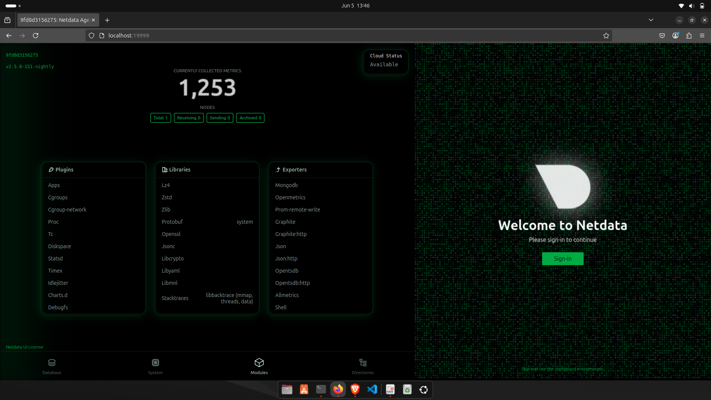
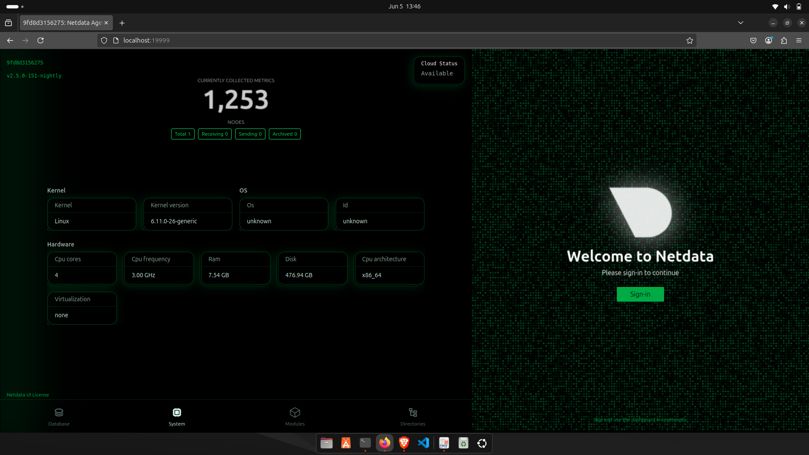
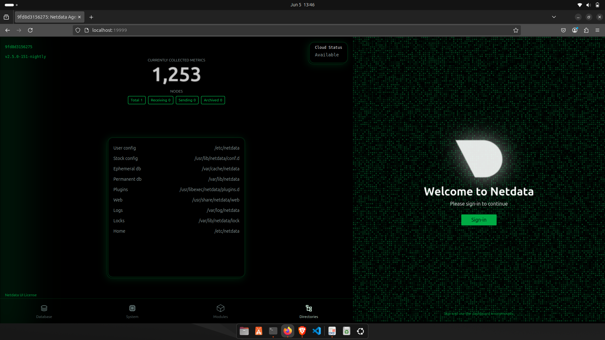

# 📊 System Resource Monitoring with Netdata via Docker

## 🎯 Task Objective
This project showcases how to monitor real-time system and application performance metrics using **Netdata**, a lightweight and powerful monitoring tool deployed via **Docker**.

> ✅ Task: Monitor CPU, Memory, Disk, and Docker container usage  
> 🔧 Tools: Netdata (v2.5.0-151-nightly), Docker  
> 📍 Goal: Understand real-time performance monitoring and observability

---

## 🚀 How to Run Netdata in Docker

1. ✅ Pull and run Netdata:
```bash
docker run -d --name=netdata -p 19999:19999 \
  --cap-add=SYS_PTRACE --security-opt apparmor=unconfined \
  netdata/netdata
```

2. 🌐 Access the Netdata dashboard:
```
http://localhost:19999
```

3. 🧠 Monitor key resources in real-time:
- CPU & Load Averages
- Memory Usage
- Disk I/O & Filesystem
- Network Traffic
- Docker Container Stats
- Systemd Services

---

## 📊 System Monitoring Overview

| Metric                  | Value                          |
|-------------------------|---------------------------------|
| OS Kernel Version       | `6.11.0-26-generic`             |
| CPU Cores               | `4`                             |
| RAM                     | `7.54 GB`                       |
| Disk Capacity           | `476.94 GB`                     |
| Architecture            | `x86_64`                        |
| Netdata Cloud Status    | `Available`                     |
| Netdata Version         | `v2.5.0-151-nightly`            |
| Metrics Collected       | `1,253`                         |
| Virtualization          | `None`                          |

---

## 🧰 Important Netdata Directories

| Component        | Path                              |
|------------------|------------------------------------|
| Config (user)    | `/etc/netdata`                    |
| Config (stock)   | `/usr/lib/netdata/conf.d`         |
| Logs             | `/var/log/netdata`                |
| Plugins          | `/usr/libexec/netdata/plugins.d`  |
| Ephemeral DB     | `/var/cache/netdata`              |
| Permanent DB     | `/var/lib/netdata`                |
| Web UI Files     | `/usr/share/netdata/web`          |

---

## 📸 Screenshot of Dashboard

>   
>   
>   
>   

> *Live view of CPU, Memory, Disk, and Container metrics in real-time*

---

## ❓ Interview Questions & Answers

### 1. What does Netdata monitor?
Netdata monitors system and app metrics including CPU, memory, disk, network, services, and containers — all in real-time.

### 2. How do you view real-time metrics?
By accessing `http://localhost:19999`, Netdata streams live data and visualizes it through interactive dashboards.

### 3. How is Netdata different from Prometheus?
| Feature           | Netdata                      | Prometheus                        |
|------------------|------------------------------|-----------------------------------|
| Setup            | One-line Docker or script     | Requires exporters & Grafana      |
| Data Resolution  | 1-second, high-frequency      | Pulls metrics at intervals        |
| Dashboard        | Built-in, real-time UI        | Needs Grafana integration         |
| Best For         | Troubleshooting, observability| Large-scale time-series analysis  |

### 4. What is a collector?
A **collector** is a plugin or module in Netdata that gathers metrics from OS, services, containers, and hardware.

### 5. What performance KPIs should be monitored?
- CPU load & usage
- RAM consumption
- Disk I/O & latency
- Network throughput
- Docker container usage
- System health & alerts

### 6. How to deploy Netdata on a VM?
You can either:
```bash
bash <(curl -Ss https://my-netdata.io/kickstart.sh)
```
Or use the Docker method as shown above.

### 7. How does Netdata alerting work?
Netdata uses preconfigured **health checks** with thresholds defined in `health.d/`. Alerts are triggered when metrics exceed defined limits.

### 8. What is a dashboard in this context?
A real-time interactive web interface where Netdata visualizes metrics, historical data, and alerts — useful for both monitoring and troubleshooting.

---

## 📦 Project Structure

```
Netdata-System-Monitoring/
├── README.md
└── screenshot.png
```

---

## ✅ Outcome

By completing this task, I learned:
- How to deploy and use Netdata in Docker
- How to monitor live system metrics interactively
- Key performance indicators for system health
- Differences between observability tools (Netdata vs Prometheus)

---

## 🔗 Useful Links
- 🌐 [Netdata Official Site](https://www.netdata.cloud/)
- 📘 [Netdata Docs](https://learn.netdata.cloud/)
- 🐳 [Netdata Docker Hub](https://hub.docker.com/r/netdata/netdata)

---

> 🚀 *Real-time monitoring is the first step toward building reliable, observable, and self-healing systems!*

